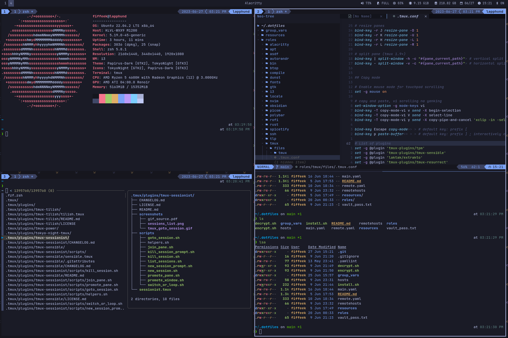

# .dotfiles
Personal dotfiles managed by Ansible.

I use Ubuntu. [Ansible](https://github.com/ansible/ansible) is leveraged to make this set up easier
on multiple machines. In the future this might be changed to [nix](https://github.com/NixOS/nix) instead.
This set up is very specific to my needs, I encourage the reader to use it 
as a reference, rather than use directly. This config is not static, and 
does change over time.

## Terminal driven development 

Development is done with the help of the three main components:
- [i3](https://i3wm.org/), with the `win` key as the modifier
- [tmux](https://github.com/tmux/tmux/wiki), with `alt` as the pane/window navigator prefix, and `ctrl + space` as the full prefix 
- [neovim](https://neovim.io/), with `ctrl` as the window navigation prefix, and `space` as the leader  

## Keyboard

Due to extensive RSI I moved to an ortholinear keyboard, [Moonlander](https://www.zsa.io/moonlander/).
Any keybinds try to leverage [my layout](https://configure.zsa.io/moonlander/layouts/manJd/latest/0).
I recommend looking into [home row modifiers](https://precondition.github.io/home-row-mods) to minimize hands movement, which helped tremendously in my case.

## Preview

Here's a preview what the desktop environment looks like:

